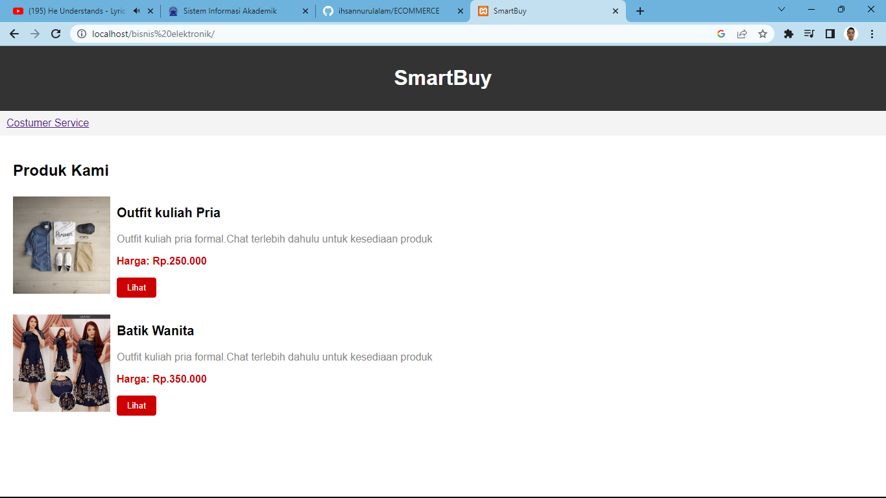
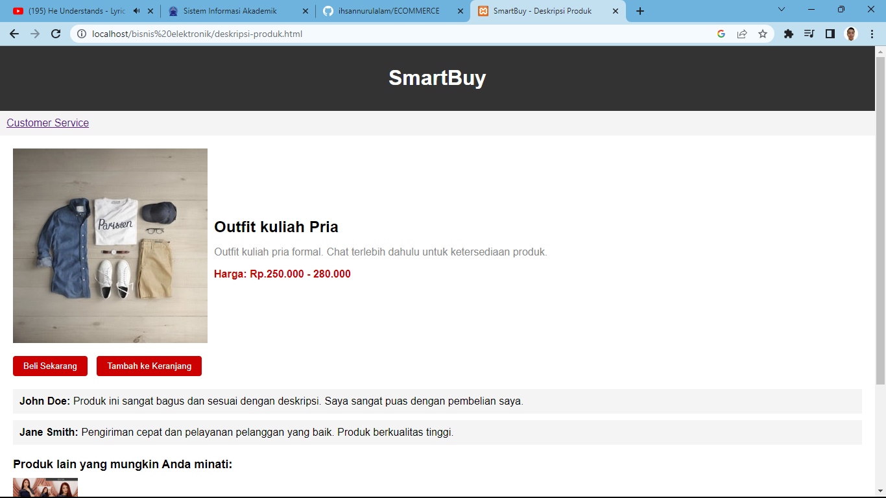
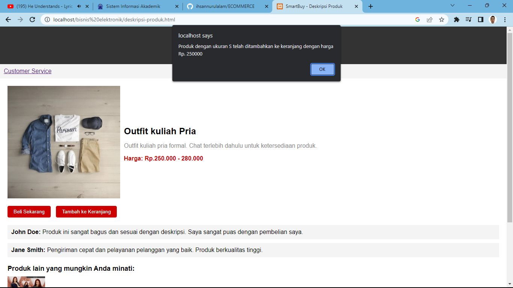
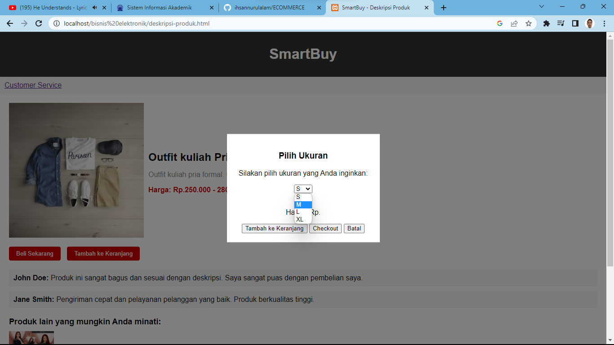
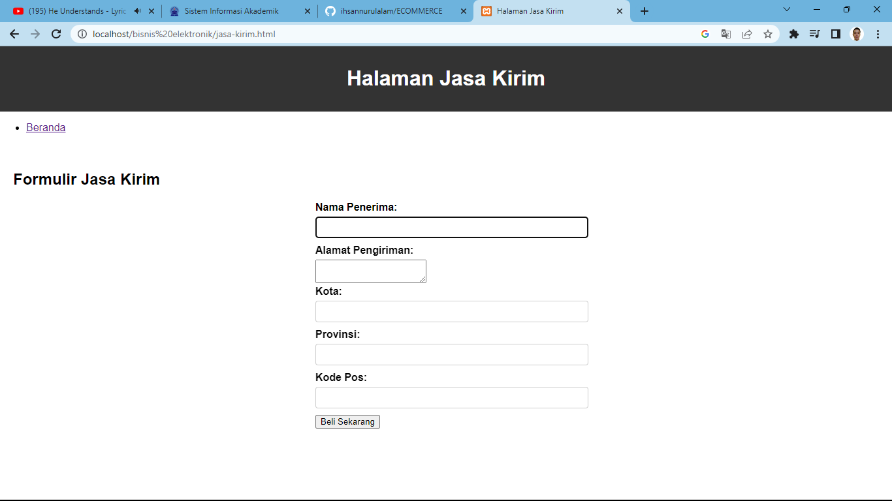
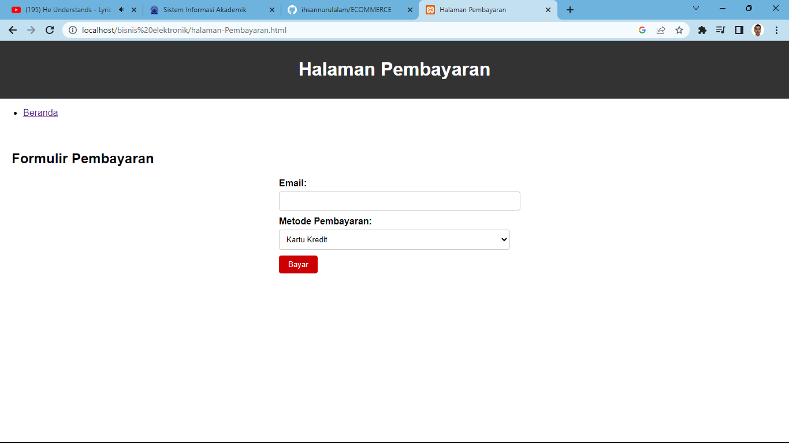
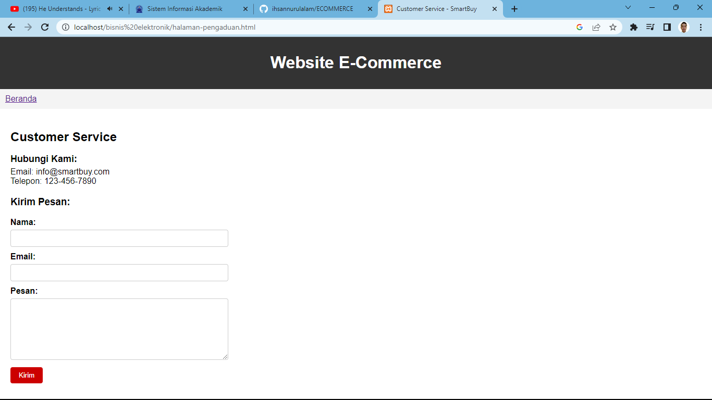

# Smart Buy

 

## Deskripsi Projek
Projek E-Commerce adalah sebuah aplikasi berbasis web yang memungkinkan pengguna untuk melakukan pembelian dan penjualan produk secara online. Aplikasi ini dirancang untuk memberikan pengalaman belanja yang nyaman dan aman bagi pengguna.

## Fitur-fitur
- Penelusuran produk: Pengguna dapat mencari produk berdasarkan kategori, merek, atau kata kunci.
- Tampilan produk: Pengguna dapat melihat detail produk, termasuk gambar, deskripsi, harga, dan stok.
- Keranjang belanja: Pengguna dapat menambahkan produk ke keranjang belanja mereka.
- Checkout: Pengguna dapat melihat ringkasan pesanan mereka dan memproses pembayaran.
- Pembayaran: Pengguna dapat memilih metode pembayaran dan memasukkan detail pembayaran mereka.
- Konfirmasi pesanan: Pengguna akan menerima konfirmasi pesanan setelah pembayaran selesai.
- Informasi dan Pengaduan

## Tim Pengembang
- Ihsan Nurul Alam ([@ihsannurulalam](https://github.com/ihsannurulalam))